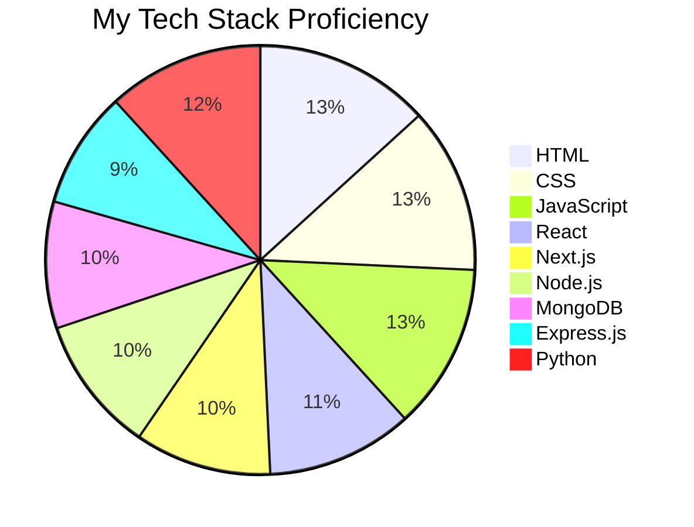

# 👋 Hey there, I'm **Safwan**!  

🎓 I'm a 19-year-old B.Tech CSE student specializing in **Full Stack Web Development**!  
💻 Passionate about creating interactive, engaging platforms and exploring the world of **3D web experiences**.  

---

## 🌟 About Me  
- 🔹 I’m currently diving deep into building web applications with **modern frameworks** like **React**, **Next.js**, and **Node.js**.  
- 🔹 Exploring advanced technologies like **Three.js** for 3D experiences and **D3.js** for data visualization.  
- 🔹 Open to collaborating on **innovative projects** and **open-source contributions**.  
- ⚡ Fun Fact: I can debug for hours without realizing it's 4 AM! 🕓  

---

## 🛠️ My Tech Toolbox  
Here’s a breakdown of the tech I use and my proficiency:  

### Tech Stack Proficiency Graph  

---

## 📈 GitHub Stats  
  
  
  

---

## 🐍 Play Snake Game on This Page!  

  <canvas id="snakeCanvas" width="500" height="500" style="border:1px solid black;"></canvas>
  

---

## 🌈 Fun Facts  
- 🎮 Gaming is my go-to for unwinding.  
- 📖 I enjoy reading about cutting-edge tech and innovations.  
- ✈️ Love traveling and exploring new cultures.  

---

## 🤝 Let’s Connect!  
I’d love to collaborate or hear about your exciting ideas.  
- 📩 [Email Me](mailto:safwan.sm125@gmail.com)  
- 💼 [Connect on LinkedIn](https://linkedin.com/in/safwan125)  

---

🌟 From [Safwan](https://github.com/safwan125)
